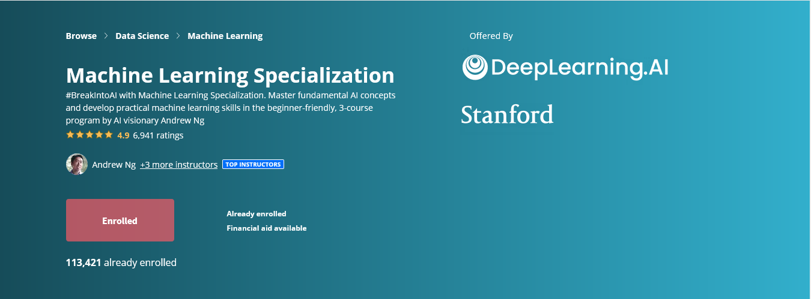

# Machine Learning Specialization by DeepLearning.AI

This repository contains my complete learnings from the [Machine Learning Specialization](https://www.coursera.org/specializations/machine-learning-introduction/?utm_medium=coursera&utm_source=home-page&utm_campaign=mlslaunch2022IN) by Andrew Ng on Coursera.

## What’s inside?

- Detailed notes (including handwritten ones)  
- Solutions to optional labs  
- Practice quizzes with answers  
- Additional resources and explanations  

This is a personal compilation to help reinforce concepts and for future reference.
